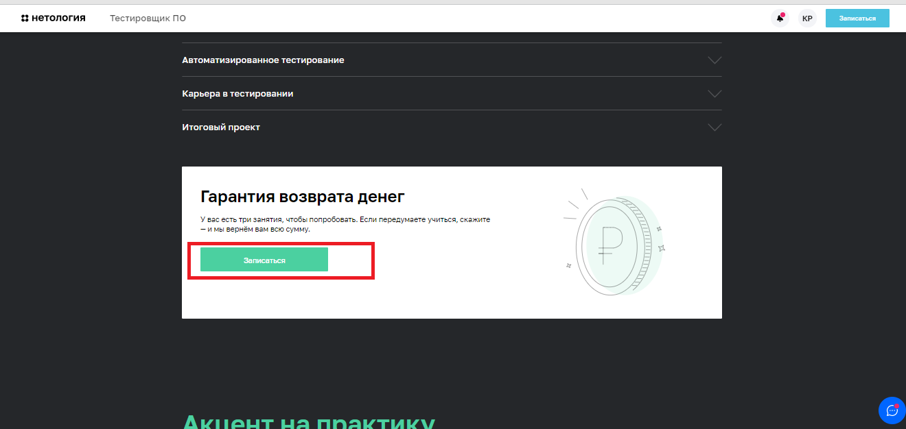

<H1>Что будем автоматизировать:</H1>

 <li>поиск страницы профессии и формы записи на ней;</li>
 
 <li>заполнение формы записи.</li>
 

<H2>1. Поиск страницы профессии и формы</H2> 

1.1 Открыть https://netology.ru/

1.2. Нажать "Каталог курсов" 

Далее - "Программирование", "Тестировщик ПО" 

Форма записи на странице курса

1.3. Нажать "Каталог курсов", далее - "Программирование", "Тестировщик ПО", 
проскроллить страницу до конца вниз к форме записи на курс. 

1.4. Нажать NEO 

Далее - "Тестировщик ПО"

 

Найти форму на странице курса. 

1.5. Перейти в самый низ главной страницы сайта 

Далее - "Программирование", "Тестировщик ПО", найти форму на странице.

1.6. На главной странице блок "Актуальные темы"

Далее - "Программирование", "Тестировщик ПО" 

 
Найти форму на странице курса.

1.7. Всплывающая кнопка "Записаться" на странице курса Тестировщик. 

1.8. кнопка записаться на поле "Гарантия возврата денег" на странице Тестировщик ПО 

<H2>2. Автоматизируемые сценарии: </H2>
<ul>
<li> <H3>поиск формы - 8 сценариев; </H3></li>
<li><H3>заполнение формы: </H3></li>
<li><H4>сценарии позитивные: </H4></li>
<li>валидные имя и телефон (учесть короткие имена из двух букв, имена через дефис, имена из 2 и более слов, лишние пробелы при вводе),</li>
<li><H4>сценарии негативные:</H4></li>
<li>невозможность отправки пустой формы, формы с незаполненным одним полем,</li>
<li>невозможность ввода символов (кроме дефиса) в поле Имя, </li>
<li>невозможность отправки формы с введенными цифрами и буквами кроме кириллицы и латиницы в поле Имя,</li>
<li>невозможность отправки формы с невалидным номером телефона (короче длинны поля).</li>
</ul>

<H2>3. Инструменты:</H2>

- ПК с установленным ПО: JDK, IntellijIDEA с фреймворками Maven или Gradle, JUnit или TestNG, Selenide, плагин Lombok,  выход в сеть Интернет.

<H2>4. Необходимые данные/разрешения/доступы: </H2>

- разрешение на автоматизированное тестирование сайта;
- доступ к базе данных;
- генератор рандомных данных.

<H2>5. Риски автоматизации:</H2>

- изменение в структуре сайта;
- изменение формы записи;
- изменение Css-селекторов полей;
- недостаточная генерация валидных данных для тестирования (не учтены уникальные имена).

<H2>6. Специалисты:</H2> 

- тестировщик ПО с навыками написания авто-тестов для UI, работы с СУБД;
- product-manager(?, кто-то же должен выдать доступ к БД).

<H2>7. Интервальная оценка </H2>
Затрудняюсь ответить. 13-15 рабочих часов(?).

 

