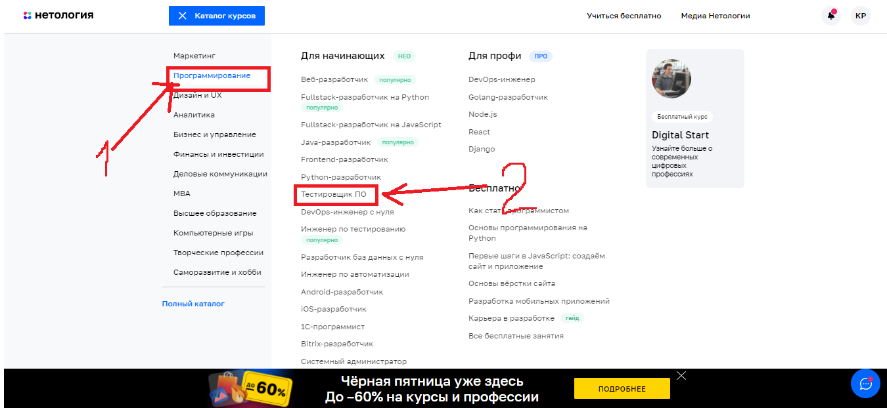
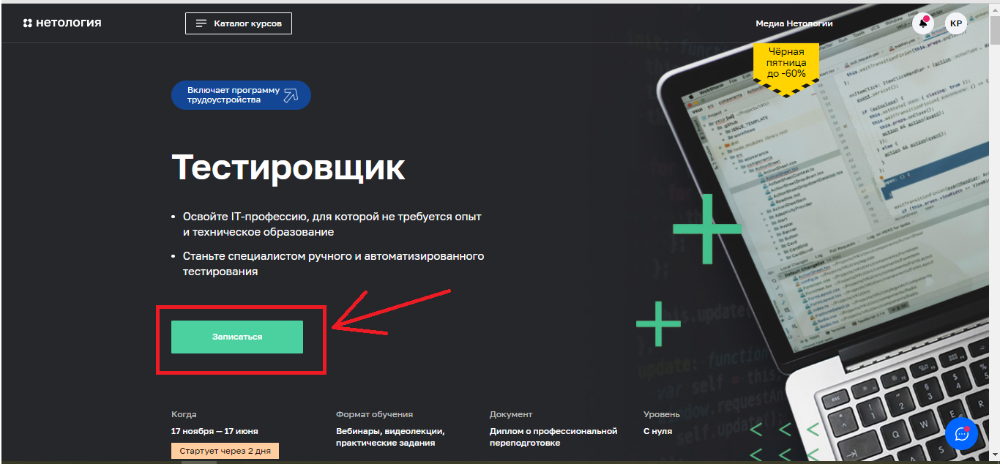
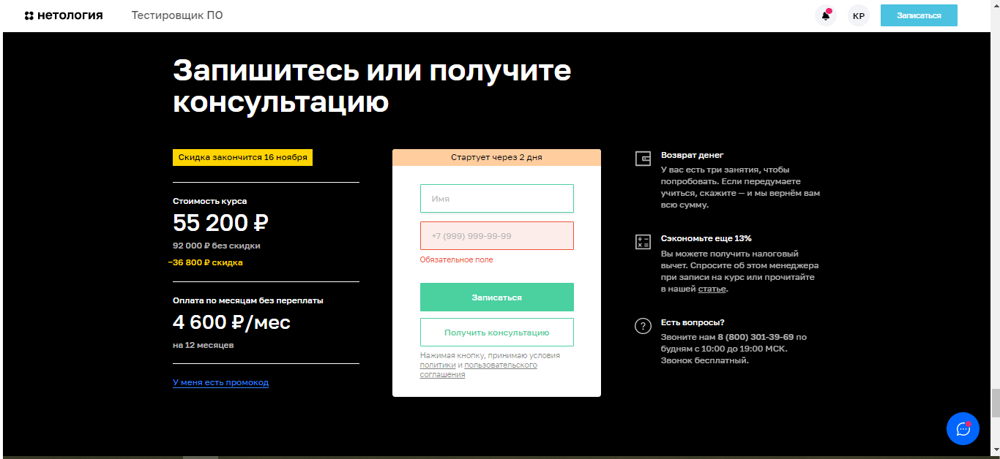
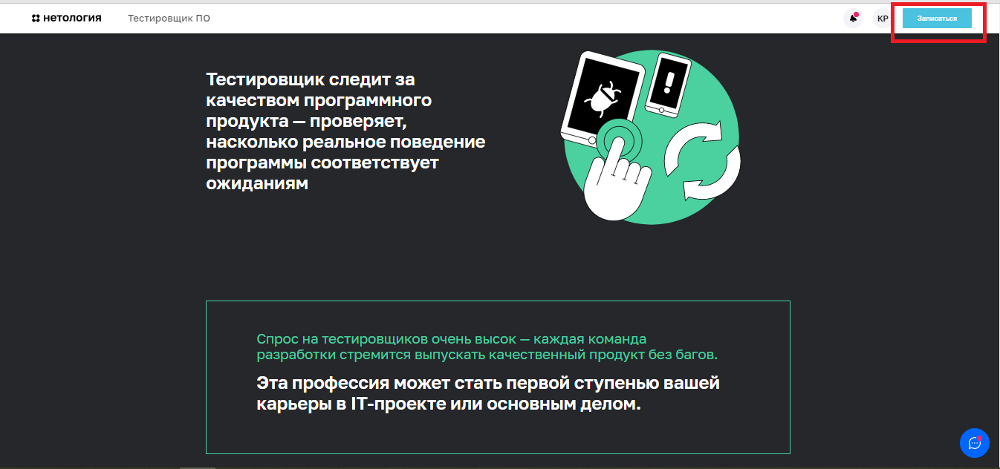
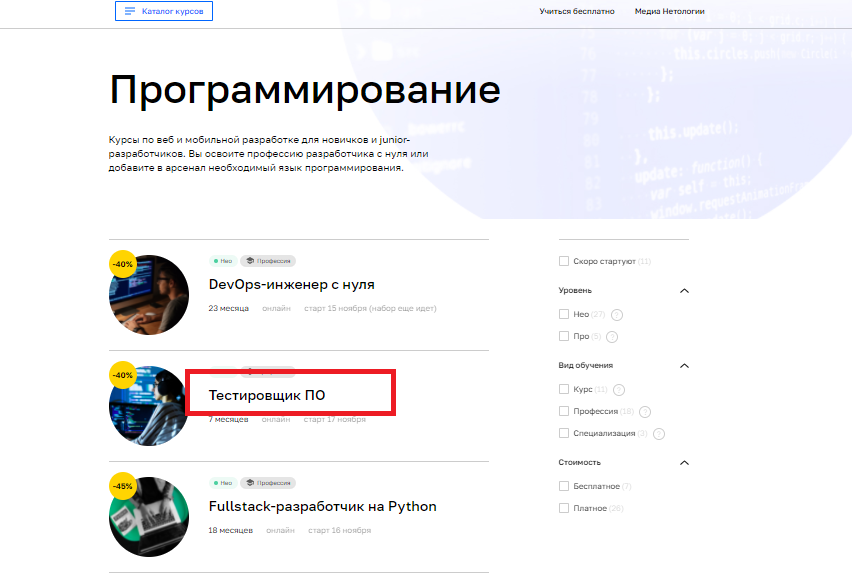
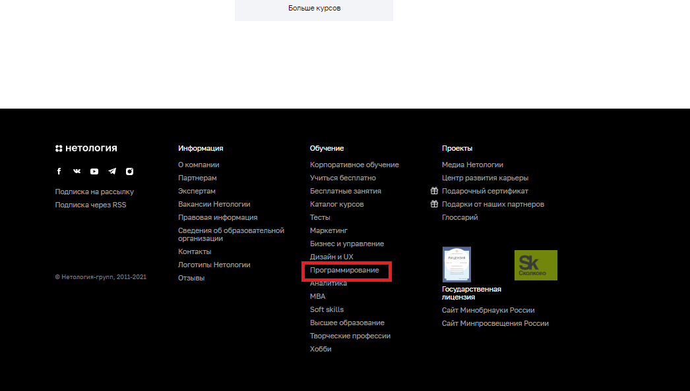
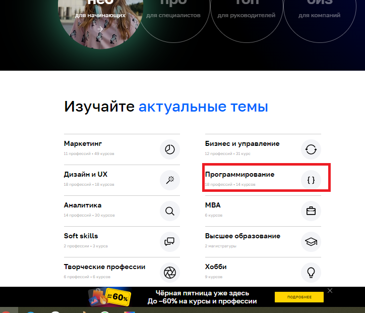

Что будем автоматизировать: 
* поиск страницы профессии и формы записи на ней;
* заполнение формы записи.

1. Поиск страницы профессии и формы 

1.1 Открыть https://netology.ru/

1.2. Нажать "Каталог курсов"  
Далее - "Программирование", "Тестировщик ПО"  
Форма записи на странице курса .

1.3. Нажать "Каталог курсов", далее - "Программирование", "Тестировщик ПО", 
проскроллить страницу до конца вниз к форме записи на курс. 

1.4. Нажать NEO 
Далее - "Тестировщик ПО"
 
Найти форму на странице курса. 

1.5. Перейти в самый низ главной страницы сайта 
Далее - "Программирование", "Тестировщик ПО", найти форму на странице.

1.6. На главной странице блок "Актуальные темы"   -Далее - "Программирование", "Тестировщик ПО" 
 
Найти форму на странице курса.

1.7. Всплывающая кнопка "Записаться" на странице курса Тестировщик. 

1.8. кнопка записаться на поле "Гарантия возврата денег" на странице Тестировщик ПО 

3. Автоматизируемые сценарии: 
- поиск формы -8 сценариев;
- заполнение формы: 
- -сценарии позитивные: 
* валидные имя и телефон (учесть короткие имена из двух букв, имена через дефис, имена из 2 и более слов, лишние пробелы при вводе),
--сценарии негативные:
* невозможность отправки пустой формы, формы с незаполненным одним полем,
* невозможность ввода символов (кроме дефиса) в поле Имя, 
* невозможность отправки формы с введенными цифрами и буквами кроме кириллицы и латиницы в поле Имя,
* невозможность отправки формы с невалидным номером телефона (короче длинны поля).

3. инструменты:
- ПК с установленным ПО: JDK, IntellijIDEA с фреймворками Maven или Gradle, JUnit или TestNG, Selenide, плагин Lombok,  выход в сеть Интернет.

4. необходимые данные/разрешения/доступы: 
- разрешение на автоматизированное тестирование сайта;
- доступ к базе данных;
- генератор рандомных данных.

5. Риски автоматизации:
- изменение в структуре сайта;
- изменение формы записи;
- изменение Css-селекторов полей;
- недостаточная генерация валидных данных для тестирования (не учтены уникальные имена).

6. специалисты: 
- тестировщик ПО с навыками написания авто-тестов для UI, работы с СУБД;
- product-manager(?, кто-то же должен выдать доступ к БД).

7. затрудняюсь ответить. 13-15 рабочих часов(?).

 

